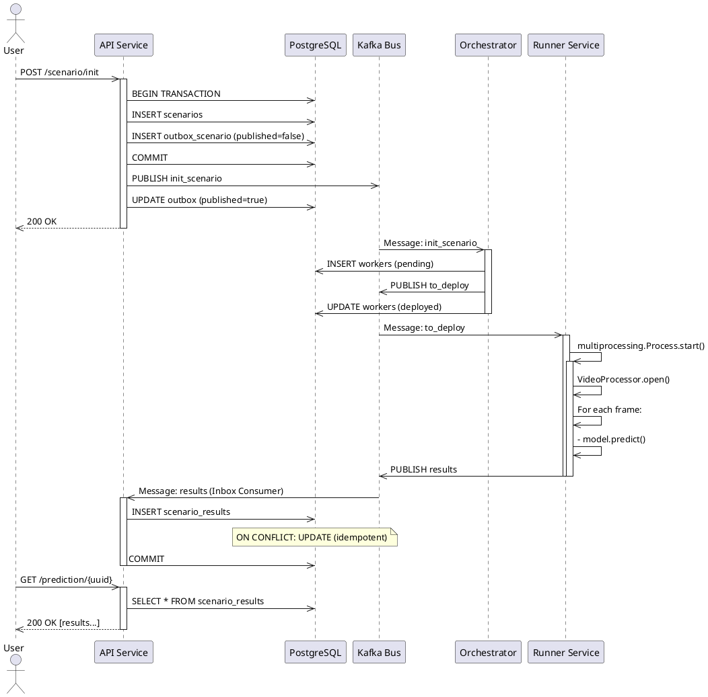

# Video Analytics Platform - Миро Архитектура

> Этот файл содержит SVG диаграммы, которые можно импортировать в Miro

---

## 1. Общая Архитектура Системы

### SVG для Miro:

```xml
<svg width="2400" height="1600" xmlns="http://www.w3.org/2000/svg">
  <!-- Background -->
  <rect width="2400" height="1600" fill="#f8f9fa"/>
  
  <!-- Title -->
  <text x="1200" y="40" font-size="32" font-weight="bold" text-anchor="middle" fill="#1a1a1a">
    Video Analytics Platform - Complete Architecture
  </text>
  
  <!-- Layer 1: Clients -->
  <g id="layer-clients">
    <rect x="800" y="80" width="800" height="120" fill="#e3f2fd" stroke="#1976d2" stroke-width="2" rx="8"/>
    <text x="1200" y="150" font-size="16" font-weight="bold" text-anchor="middle">External Clients (Users)</text>
  </g>
  
  <!-- Arrow -->
  <line x1="1200" y1="200" x2="1200" y2="240" stroke="#666" stroke-width="2" marker-end="url(#arrowhead)"/>
  
  <!-- Layer 2: Load Balancer -->
  <g id="layer-lb">
    <rect x="800" y="240" width="800" height="100" fill="#f3e5f5" stroke="#7b1fa2" stroke-width="2" rx="8"/>
    <text x="1200" y="295" font-size="14" text-anchor="middle">Load Balancer (Optional)</text>
  </g>
  
  <!-- Arrow -->
  <line x1="1200" y1="340" x2="1200" y2="380" stroke="#666" stroke-width="2" marker-end="url(#arrowhead)"/>
  
  <!-- Layer 3: API Instances -->
  <g id="layer-api">
    <!-- API Instance 1 -->
    <rect x="200" y="380" width="280" height="150" fill="#c8e6c9" stroke="#388e3c" stroke-width="2" rx="8"/>
    <text x="340" y="410" font-size="12" font-weight="bold" text-anchor="middle">API Instance #1</text>
    <text x="340" y="430" font-size="10" text-anchor="middle">FastAPI:8000</text>
    
    <!-- API Instance 2 -->
    <rect x="560" y="380" width="280" height="150" fill="#c8e6c9" stroke="#388e3c" stroke-width="2" rx="8"/>
    <text x="700" y="410" font-size="12" font-weight="bold" text-anchor="middle">API Instance #2</text>
    <text x="700" y="430" font-size="10" text-anchor="middle">FastAPI:8000</text>
    
    <!-- API Instance N -->
    <rect x="920" y="380" width="280" height="150" fill="#c8e6c9" stroke="#388e3c" stroke-width="2" rx="8"/>
    <text x="1060" y="410" font-size="12" font-weight="bold" text-anchor="middle">API Instance #N</text>
    <text x="1060" y="430" font-size="10" text-anchor="middle">Stateless</text>
  </g>
  
  <!-- Arrow -->
  <line x1="1200" y1="530" x2="1200" y2="570" stroke="#666" stroke-width="2" marker-end="url(#arrowhead)"/>
  
  <!-- Layer 4: Infrastructure (PostgreSQL, Kafka, Redis) -->
  <g id="layer-infrastructure">
    <!-- PostgreSQL -->
    <rect x="100" y="570" width="280" height="140" fill="#ffe0b2" stroke="#f57c00" stroke-width="2" rx="8"/>
    <text x="240" y="600" font-size="12" font-weight="bold" text-anchor="middle">PostgreSQL</text>
    <text x="240" y="620" font-size="10" text-anchor="middle">scenarios</text>
    <text x="240" y="635" font-size="10" text-anchor="middle">results</text>
    <text x="240" y="650" font-size="10" text-anchor="middle">outbox</text>
    
    <!-- Kafka -->
    <rect x="490" y="570" width="280" height="140" fill="#ffccbc" stroke="#d84315" stroke-width="2" rx="8"/>
    <text x="630" y="600" font-size="12" font-weight="bold" text-anchor="middle">Apache Kafka</text>
    <text x="630" y="620" font-size="10" text-anchor="middle">init_scenario</text>
    <text x="630" y="635" font-size="10" text-anchor="middle">to_deploy</text>
    <text x="630" y="650" font-size="10" text-anchor="middle">results</text>
    
    <!-- Redis (Optional) -->
    <rect x="880" y="570" width="280" height="140" fill="#f8bbd0" stroke="#c2185b" stroke-width="2" rx="8"/>
    <text x="1020" y="600" font-size="12" font-weight="bold" text-anchor="middle">Redis Cache</text>
    <text x="1020" y="620" font-size="10" text-anchor="middle">Optional</text>
    <text x="1020" y="635" font-size="10" text-anchor="middle">Session store</text>
  </g>
  
  <!-- Connections from API to Infrastructure -->
  <line x1="340" y1="530" x2="240" y2="570" stroke="#666" stroke-width="2"/>
  <line x1="700" y1="530" x2="630" y2="570" stroke="#666" stroke-width="2"/>
  <line x1="1060" y1="530" x2="1020" y2="570" stroke="#666" stroke-width="2"/>
  
  <!-- Arrow -->
  <line x1="1200" y1="710" x2="1200" y2="750" stroke="#666" stroke-width="2" marker-end="url(#arrowhead)"/>
  
  <!-- Layer 5: Orchestrator Instances -->
  <g id="layer-orchestrator">
    <!-- Orchestrator 1 -->
    <rect x="200" y="750" width="280" height="140" fill="#bbdefb" stroke="#1565c0" stroke-width="2" rx="8"/>
    <text x="340" y="780" font-size="12" font-weight="bold" text-anchor="middle">Orchestrator #1</text>
    <text x="340" y="800" font-size="10" text-anchor="middle">Leader</text>
    <text x="340" y="820" font-size="10" text-anchor="middle">Kafka Consumer</text>
    
    <!-- Orchestrator 2 -->
    <rect x="560" y="750" width="280" height="140" fill="#bbdefb" stroke="#1565c0" stroke-width="2" rx="8"/>
    <text x="700" y="780" font-size="12" font-weight="bold" text-anchor="middle">Orchestrator #2</text>
    <text x="700" y="800" font-size="10" text-anchor="middle">Standby</text>
    
    <!-- Orchestrator N -->
    <rect x="920" y="750" width="280" height="140" fill="#bbdefb" stroke="#1565c0" stroke-width="2" rx="8"/>
    <text x="1060" y="780" font-size="12" font-weight="bold" text-anchor="middle">Orchestrator #N</text>
  </g>
  
  <!-- Arrow -->
  <line x1="1200" y1="890" x2="1200" y2="930" stroke="#666" stroke-width="2" marker-end="url(#arrowhead)"/>
  
  <!-- Layer 6: to_deploy Topic Consumers -->
  <g id="layer-to-deploy">
    <rect x="800" y="930" width="800" height="100" fill="#c8e6c9" stroke="#2e7d32" stroke-width="2" rx="8"/>
    <text x="1200" y="965" font-size="14" font-weight="bold" text-anchor="middle">Kafka Topic: to_deploy</text>
  </g>
  
  <!-- Arrow -->
  <line x1="1200" y1="1030" x2="1200" y2="1070" stroke="#666" stroke-width="2" marker-end="url(#arrowhead)"/>
  
  <!-- Layer 7: Runner Service -->
  <g id="layer-runner">
    <rect x="400" y="1070" width="1600" height="280" fill="#d1c4e9" stroke="#512da8" stroke-width="2" rx="8"/>
    <text x="1200" y="1100" font-size="14" font-weight="bold" text-anchor="middle">Runner Service</text>
    
    <!-- Consumer Thread -->
    <rect x="450" y="1120" width="320" height="80" fill="#ede7f6" stroke="#7e57c2" stroke-width="1" rx="4"/>
    <text x="610" y="1145" font-size="11" font-weight="bold" text-anchor="middle">Consumer Thread</text>
    <text x="610" y="1165" font-size="9" text-anchor="middle">Listening to_deploy</text>
    
    <!-- WorkerManager -->
    <rect x="840" y="1120" width="320" height="80" fill="#ede7f6" stroke="#7e57c2" stroke-width="1" rx="4"/>
    <text x="1000" y="1145" font-size="11" font-weight="bold" text-anchor="middle">WorkerManager</text>
    <text x="1000" y="1165" font-size="9" text-anchor="middle">MAX_WORKERS=4</text>
    
    <!-- Process Pool -->
    <rect x="1230" y="1120" width="720" height="80" fill="#ede7f6" stroke="#7e57c2" stroke-width="1" rx="4"/>
    <text x="1590" y="1145" font-size="11" font-weight="bold" text-anchor="middle">Worker Process Pool</text>
    <text x="1590" y="1165" font-size="9" text-anchor="middle">Process #1 | Process #2 | Process #3 | ...</text>
    
    <!-- Process Details -->
    <g id="process-pool" transform="translate(1230, 1220)">
      <!-- Process 1 Details -->
      <rect x="0" y="0" width="170" height="100" fill="#f3e5f5" stroke="#9575cd" stroke-width="1" rx="4"/>
      <text x="85" y="20" font-size="10" font-weight="bold" text-anchor="middle">Process #1</text>
      <text x="85" y="35" font-size="8" text-anchor="middle">OpenCV</text>
      <text x="85" y="48" font-size="8" text-anchor="middle">Inference</text>
      <text x="85" y="61" font-size="8" text-anchor="middle">Kafka</text>
      
      <!-- Process 2 Details -->
      <rect x="190" y="0" width="170" height="100" fill="#f3e5f5" stroke="#9575cd" stroke-width="1" rx="4"/>
      <text x="275" y="20" font-size="10" font-weight="bold" text-anchor="middle">Process #2</text>
      
      <!-- Process 3 Details -->
      <rect x="380" y="0" width="170" height="100" fill="#f3e5f5" stroke="#9575cd" stroke-width="1" rx="4"/>
      <text x="465" y="20" font-size="10" font-weight="bold" text-anchor="middle">Process #3</text>
    </g>
  </g>
  
  <!-- Arrow marker definition -->
  <defs>
    <marker id="arrowhead" markerWidth="10" markerHeight="10" refX="9" refY="3" orient="auto">
      <polygon points="0 0, 10 3, 0 6" fill="#666"/>
    </marker>
  </defs>
</svg>
```

---

## 2. Детальный Flow: API → Orchestrator → Runner

```xml
<svg width="2400" height="1200" xmlns="http://www.w3.org/2000/svg">
  <!-- Background -->
  <rect width="2400" height="1200" fill="#f5f5f5"/>
  
  <!-- Title -->
  <text x="1200" y="40" font-size="28" font-weight="bold" text-anchor="middle">Message Flow: API → Orchestrator → Runner</text>
  
  <!-- Timeline grid -->
  <g id="timeline" opacity="0.3">
    <line x1="0" y1="100" x2="2400" y2="100" stroke="#ccc" stroke-width="1"/>
    <line x1="0" y1="200" x2="2400" y2="200" stroke="#ccc" stroke-width="1"/>
    <line x1="0" y1="300" x2="2400" y2="300" stroke="#ccc" stroke-width="1"/>
    <line x1="0" y1="400" x2="2400" y2="400" stroke="#ccc" stroke-width="1"/>
    <line x1="0" y1="500" x2="2400" y2="500" stroke="#ccc" stroke-width="1"/>
    <line x1="0" y1="600" x2="2400" y2="600" stroke="#ccc" stroke-width="1"/>
  </g>
  
  <!-- Vertical swimlanes -->
  <g id="swimlanes" opacity="0.2">
    <line x1="400" y1="100" x2="400" y2="1100" stroke="#ccc" stroke-width="1" stroke-dasharray="5,5"/>
    <line x1="800" y1="100" x2="800" y2="1100" stroke="#ccc" stroke-width="1" stroke-dasharray="5,5"/>
    <line x1="1200" y1="100" x2="1200" y2="1100" stroke="#ccc" stroke-width="1" stroke-dasharray="5,5"/>
    <line x1="1600" y1="100" x2="1600" y2="1100" stroke="#ccc" stroke-width="1" stroke-dasharray="5,5"/>
    <line x1="2000" y1="100" x2="2000" y2="1100" stroke="#ccc" stroke-width="1" stroke-dasharray="5,5"/>
  </g>
  
  <!-- T0: User calls API -->
  <g id="t0">
    <text x="50" y="130" font-size="12" font-weight="bold" fill="#1976d2">T0</text>
    <circle cx="400" cy="120" r="20" fill="#c8e6c9" stroke="#2e7d32" stroke-width="2"/>
    <text x="400" y="125" font-size="10" text-anchor="middle" font-weight="bold">User</text>
    
    <path d="M 420 120 L 750 120" stroke="#1976d2" stroke-width="2" marker-end="url(#arrowhead-blue)"/>
    <text x="585" y="105" font-size="10" fill="#1976d2">POST /scenario/init</text>
  </g>
  
  <!-- T0+50ms: API saves to DB -->
  <g id="t0-50">
    <text x="50" y="230" font-size="12" font-weight="bold" fill="#f57c00">T0+50ms</text>
    <rect x="750" y="190" width="100" height="80" fill="#fff3e0" stroke="#f57c00" stroke-width="2" rx="4"/>
    <text x="800" y="210" font-size="9" text-anchor="middle">API</text>
    <text x="800" y="230" font-size="9" text-anchor="middle">INSERT</text>
    <text x="800" y="248" font-size="9" text-anchor="middle">scenarios</text>
  </g>
  
  <!-- T0+100ms: Publish to init_scenario -->
  <g id="t0-100">
    <text x="50" y="330" font-size="12" font-weight="bold" fill="#d84315">T0+100ms</text>
    <path d="M 800 270 L 1100 300" stroke="#d84315" stroke-width="2" marker-end="url(#arrowhead-red)"/>
    <text x="950" y="280" font-size="10" fill="#d84315">Publish: init_scenario</text>
    
    <rect x="1100" y="260" width="100" height="80" fill="#ffebee" stroke="#d84315" stroke-width="2" rx="4"/>
    <text x="1150" y="280" font-size="9" text-anchor="middle">Kafka</text>
    <text x="1150" y="298" font-size="9" text-anchor="middle">init_scenario</text>
  </g>
  
  <!-- T0+150ms: Orchestrator consumes -->
  <g id="t0-150">
    <text x="50" y="430" font-size="12" font-weight="bold" fill="#7b1fa2">T0+150ms</text>
    <path d="M 1200 340 L 1500 380" stroke="#7b1fa2" stroke-width="2" marker-end="url(#arrowhead-purple)"/>
    <text x="1350" y="355" font-size="10" fill="#7b1fa2">Read message</text>
    
    <rect x="1500" y="340" width="100" height="80" fill="#f3e5f5" stroke="#7b1fa2" stroke-width="2" rx="4"/>
    <text x="1550" y="360" font-size="9" text-anchor="middle">Orchestrator</text>
    <text x="1550" y="378" font-size="9" text-anchor="middle">Process</text>
  </g>
  
  <!-- T0+200ms: Orchestrator saves worker -->
  <g id="t0-200">
    <text x="50" y="530" font-size="12" font-weight="bold" fill="#1565c0">T0+200ms</text>
    <path d="M 1500 420 L 800 460" stroke="#1565c0" stroke-width="2" marker-end="url(#arrowhead-blue)"/>
    <text x="1150" y="440" font-size="10" fill="#1565c0">INSERT workers</text>
    
    <rect x="750" y="420" width="100" height="80" fill="#e3f2fd" stroke="#1565c0" stroke-width="2" rx="4"/>
    <text x="800" y="440" font-size="9" text-anchor="middle">PostgreSQL</text>
    <text x="800" y="458" font-size="9" text-anchor="middle">workers</text>
  </g>
  
  <!-- T0+250ms: Publish to_deploy -->
  <g id="t0-250">
    <text x="50" y="630" font-size="12" font-weight="bold" fill="#c62828">T0+250ms</text>
    <path d="M 1500 420 L 1200 500" stroke="#c62828" stroke-width="2" marker-end="url(#arrowhead-dark-red)"/>
    <text x="1350" y="455" font-size="10" fill="#c62828">Publish: to_deploy</text>
    
    <rect x="1100" y="480" width="100" height="80" fill="#ffcdd2" stroke="#c62828" stroke-width="2" rx="4"/>
    <text x="1150" y="500" font-size="9" text-anchor="middle">Kafka</text>
    <text x="1150" y="518" font-size="9" text-anchor="middle">to_deploy</text>
  </g>
  
  <!-- T0+300ms: Runner consumes -->
  <g id="t0-300">
    <text x="50" y="730" font-size="12" font-weight="bold" fill="#00695c">T0+300ms</text>
    <path d="M 1200 560 L 1900 620" stroke="#00695c" stroke-width="2" marker-end="url(#arrowhead-teal)"/>
    <text x="1550" y="585" font-size="10" fill="#00695c">Read message</text>
    
    <rect x="1900" y="580" width="100" height="80" fill="#b2dfdb" stroke="#00695c" stroke-width="2" rx="4"/>
    <text x="1950" y="600" font-size="9" text-anchor="middle">Runner</text>
    <text x="1950" y="618" font-size="9" text-anchor="middle">Process.start()</text>
  </g>
  
  <!-- T0+350ms: Worker processes video -->
  <g id="t0-350">
    <text x="50" y="830" font-size="12" font-weight="bold" fill="#455a64">T0+350ms+</text>
    <path d="M 1950 660 L 1200 720" stroke="#455a64" stroke-width="2" marker-end="url(#arrowhead-gray)"/>
    <text x="1575" y="685" font-size="10" fill="#455a64">Publish: results</text>
    
    <rect x="1100" y="700" width="100" height="80" fill="#eceff1" stroke="#455a64" stroke-width="2" rx="4"/>
    <text x="1150" y="720" font-size="9" text-anchor="middle">Kafka</text>
    <text x="1150" y="738" font-size="9" text-anchor="middle">results</text>
  </g>
  
  <!-- T0+400ms: API Inbox receives -->
  <g id="t0-400">
    <text x="50" y="930" font-size="12" font-weight="bold" fill="#1565c0">T0+400ms+</text>
    <path d="M 1100 700 L 850 800" stroke="#1565c0" stroke-width="2" marker-end="url(#arrowhead-blue)"/>
    <text x="975" y="750" font-size="10" fill="#1565c0">Update results</text>
    
    <rect x="750" y="780" width="100" height="80" fill="#c8e6c9" stroke="#2e7d32" stroke-width="2" rx="4"/>
    <text x="800" y="800" font-size="9" text-anchor="middle">PostgreSQL</text>
    <text x="800" y="818" font-size="9" text-anchor="middle">scenario_results</text>
  </g>
  
  <!-- T0+500ms: User gets results -->
  <g id="t0-500">
    <text x="50" y="1030" font-size="12" font-weight="bold" fill="#1976d2">T0+500ms+</text>
    <path d="M 850 860 L 420 900" stroke="#1976d2" stroke-width="2" marker-end="url(#arrowhead-blue)"/>
    <text x="635" y="880" font-size="10" fill="#1976d2">GET /prediction</text>
    
    <circle cx="400" cy="920" r="20" fill="#c8e6c9" stroke="#2e7d32" stroke-width="2"/>
    <text x="400" y="928" font-size="9" text-anchor="middle" font-weight="bold">User</text>
  </g>
  
  <!-- Arrow marker definitions -->
  <defs>
    <marker id="arrowhead-blue" markerWidth="10" markerHeight="10" refX="9" refY="3" orient="auto">
      <polygon points="0 0, 10 3, 0 6" fill="#1976d2"/>
    </marker>
    <marker id="arrowhead-red" markerWidth="10" markerHeight="10" refX="9" refY="3" orient="auto">
      <polygon points="0 0, 10 3, 0 6" fill="#d84315"/>
    </marker>
    <marker id="arrowhead-purple" markerWidth="10" markerHeight="10" refX="9" refY="3" orient="auto">
      <polygon points="0 0, 10 3, 0 6" fill="#7b1fa2"/>
    </marker>
    <marker id="arrowhead-dark-red" markerWidth="10" markerHeight="10" refX="9" refY="3" orient="auto">
      <polygon points="0 0, 10 3, 0 6" fill="#c62828"/>
    </marker>
    <marker id="arrowhead-teal" markerWidth="10" markerHeight="10" refX="9" refY="3" orient="auto">
      <polygon points="0 0, 10 3, 0 6" fill="#00695c"/>
    </marker>
    <marker id="arrowhead-gray" markerWidth="10" markerHeight="10" refX="9" refY="3" orient="auto">
      <polygon points="0 0, 10 3, 0 6" fill="#455a64"/>
    </marker>
  </defs>
</svg>
```

---

## 3. Как Импортировать в Miro

### Опция 1: Прямюю импорт SVG

1. Откройте Miro
2. Нажмите **Menu** → **Import** → **SVG**
3. Выберите SVG диаграммы из этого файла

### Опция 2: Конвертировать PlantUML

```plantuml
@startuml Video Analytics Architecture

!theme plain

' Colors
!define API_COLOR #C8E6C9
!define DB_COLOR #FFE0B2
!define KAFKA_COLOR #FFCCBC
!define ORCHESTRATOR_COLOR #BBDEFB
!define RUNNER_COLOR #D1C4E9
!define CLIENT_COLOR #E3F2FD

' Components
package "Clients" #CLIENT_COLOR {
  actor User
}

package "API Layer" #API_COLOR {
  component API1 as "API Instance 1"
  component API2 as "API Instance 2"
  component APIH as "API Instance N"
}

package "Data & Messaging" #FFE0B2 {
  database PostgreSQL
  queue Kafka
  database Redis
}

package "Orchestration" #ORCHESTRATOR_COLOR {
  component Orch1 as "Orchestrator 1"
  component Orch2 as "Orchestrator 2"
  component OrchH as "Orchestrator N"
}

package "Processing" #RUNNER_COLOR {
  component Runner
  component WM as "WorkerManager"
  component P1 as "Process 1"
  component P2 as "Process 2"
  component PN as "Process N"
}

' Relationships
User --> API1
User --> API2
User --> APIH

API1 --> PostgreSQL
API1 --> Kafka
API2 --> PostgreSQL
API2 --> Kafka
APAH --> PostgreSQL
APAH --> Kafka

PostgreSQL --> Orch1
PostgreSQL --> Orch2
PostgreSQL --> OrchH

Kafka --> Orch1
Kafka --> Orch2
Kafka --> OrchH

Orch1 --> Kafka
Orch2 --> Kafka
OrchH --> Kafka

Kafka --> Runner
Runner --> WM
WM --> P1
WM --> P2
WM --> PN

P1 --> Kafka
P2 --> Kafka
PN --> Kafka

Kafka --> API1
Kafka --> API2
Kafka --> APIH

@enduml
```

---

## 4. JSON для Miro API (Programmatic)

```json
{
  "board": {
    "title": "Video Analytics Platform Architecture",
    "shapes": [
      {
        "type": "rectangle",
        "x": 0,
        "y": 0,
        "width": 400,
        "height": 200,
        "fill": "#C8E6C9",
        "stroke": "#388E3C",
        "text": "API Instance 1",
        "id": "api-1"
      },
      {
        "type": "rectangle",
        "x": 500,
        "y": 0,
        "width": 400,
        "height": 200,
        "fill": "#FFE0B2",
        "stroke": "#F57C00",
        "text": "PostgreSQL",
        "id": "db-1"
      },
      {
        "type": "rectangle",
        "x": 1000,
        "y": 0,
        "width": 400,
        "height": 200,
        "fill": "#FFCCBC",
        "stroke": "#D84315",
        "text": "Apache Kafka",
        "id": "kafka-1"
      },
      {
        "type": "rectangle",
        "x": 1500,
        "y": 0,
        "width": 400,
        "height": 200,
        "fill": "#BBDEFB",
        "stroke": "#1565C0",
        "text": "Orchestrator",
        "id": "orchestrator-1"
      },
      {
        "type": "rectangle",
        "x": 2000,
        "y": 0,
        "width": 400,
        "height": 200,
        "fill": "#D1C4E9",
        "stroke": "#512DA8",
        "text": "Runner Service",
        "id": "runner-1"
      }
    ],
    "connections": [
      {
        "from": "api-1",
        "to": "db-1",
        "type": "arrow",
        "label": "Read/Write"
      },
      {
        "from": "api-1",
        "to": "kafka-1",
        "type": "arrow",
        "label": "Publish: init_scenario"
      },
      {
        "from": "kafka-1",
        "to": "orchestrator-1",
        "type": "arrow",
        "label": "Consume"
      },
      {
        "from": "orchestrator-1",
        "to": "kafka-1",
        "type": "arrow",
        "label": "Publish: to_deploy"
      },
      {
        "from": "kafka-1",
        "to": "runner-1",
        "type": "arrow",
        "label": "Consume"
      },
      {
        "from": "runner-1",
        "to": "kafka-1",
        "type": "arrow",
        "label": "Publish: results"
      },
      {
        "from": "kafka-1",
        "to": "api-1",
        "type": "arrow",
        "label": "Consume results"
      }
    ]
  }
}
```

---

## 5. PlantUML Sequence Diagram



---

## 6. Best Practices для Miro

### У да диаграммы в Miro:

✅ **Используйте цветовое кодирование**
- 🟢 Green: Stateless services (API, Runners)
- 🟠 Orange: Data storage (PostgreSQL)
- 🔴 Red: Message broker (Kafka)
- 🔵 Blue: Coordination (Orchestrator)
- 🟣 Purple: Processing (Runner workers)

✅ **Добавьте подписи на связи**
- На каждой стрелке укажите тип сообщения
- Временные метки (T0, T0+50ms, etc)

✅ **Используйте слои (Layers)**
- Layer 1: Clients
- Layer 2: API
- Layer 3: Infrastructure
- Layer 4: Orchestration
- Layer 5: Processing

✅ **Группировка по функции**
- Group message flow items together
- Group database tables together
- Group worker processes together

✅ **Интерактивные элементы**
- Используйте shapes с номерами для шагов
- Стрелки с разными стилями для разных типов связей
- Sticky notes для аннотаций

---

## 7. Альтернативные Форматы

### draw.io (XML)
```xml
<?xml version="1.0" encoding="UTF-8"?>
<mxfile host="app.diagrams.net">
  <diagram name="Architecture">
    <mxGraphModel>
      <!-- Shapes and connections export from diagrams.net -->
    </mxGraphModel>
  </diagram>
</mxfile>
```

### Lucidchart (JSON)
Экспортируйте как JSON из Lucidchart и импортируйте в Miro

---

## 8. Рекомендации для Визуализации

### Диаграммы для создания в Miro:

1. **Main Architecture** (2400×1600)
   - All components with color coding
   - Layer-based organization

2. **Data Flow Timeline** (2400×1200)
   - T0 to T500ms
   - Component interactions

3. **Kafka Topics** (2000×1400)
   - init_scenario topic
   - to_deploy topic
   - results topic
   - Message structure

4. **Database Schema** (2000×1600)
   - All 4 tables
   - Relationships
   - Indices

5. **State Machines** (2000×1200)
   - Scenario lifecycle
   - Worker states
   - Transitions

6. **Reliability Patterns** (2400×1400)
   - Transactional Outbox
   - Idempotent Inbox
   - Error recovery

---

## 9. Быстрые Ссылки

- **Miro Board Import**: https://miro.com/app/board/
- **PlantUML Online**: http://www.plantuml.com/plantuml/uml/
- **Lucidchart Export**: Export → Download as → Other format

---

Это компле полный набор для визуализации архитектуры в Miro! 🎨
